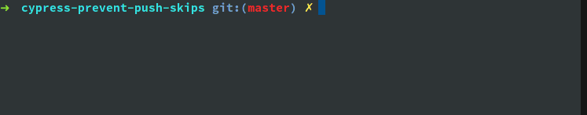

# Prevent push when skipping Cypress tests

Make sure your Cypress testing pipeline never let's you push broken code
when accidentally skipping tests.

## Setup

```bash
git clone https://git.peterbabic.dev/demo/cypress-prevent-push-skips.git
cd cypress-prevent-push-skips
npm install
```

## How does it work



Edit [spec.js](cypress/integration/spec.js), add **.skip** or **.only**
modifier to the test or tests and try to push any commited changes this way
to the repository. The push shoud fail due to pre-push hook, taht makes
sure that the push fails in two situations:

1. any test contains **.skip** or **.only**, which means not all of them
   would be executed
1. any test fails, step 1 endures al ltests are executed

The detection happens in the
[package.json](https://git.peterbabic.dev/demo/cypress-prevent-push-skips/src/branch/master/package.json#L13)

```bash
grep -Rvzq -e '.skip' -e '.only' cypress/integration
```

More details described in the blog post located at:

<https://peterbabic.dev/blog/prevent-push-when-skipping-cypress-tests>

## Preventing the behavior

The push can be executed even with skipping or failing tests by supplying
`--no-verify`

```bash
git push origin master --no-verify
```

## Possible improvements

Currently, the message provided looks like this:

```bash
$ git push origin master
husky > pre-push (node v14.9.0)
husky > pre-push hook failed (add --no-verify to bypass)
error: failed to push some refs to 'git.peterbabic.dev:demo/cypress-prevent-push-skips.git'
```

However, it is not clear why the pre-push hook failed. The verbosity could
be improved.

## License

MIT
