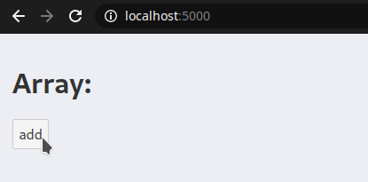

# Using CSS selectors on Markdown in JS

This is a source code repository for the blog post

<https://peterbabic.dev/blog/using-css-selectors-on-markdown>

## Setup

```bash
git clone https://git.peterbabic.dev/demo/arrays-svelte-localstorage.git
cd arrays-svelte-localstorage
npm install
npm run start
```

Now navigate to <http://localhost:5000/>. You should be able to persist
data in the array after the refresh, as seen below.



## License

MIT
